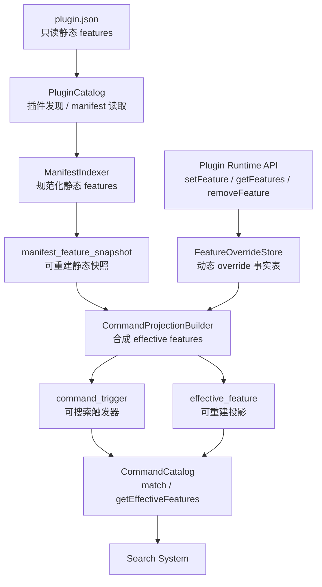
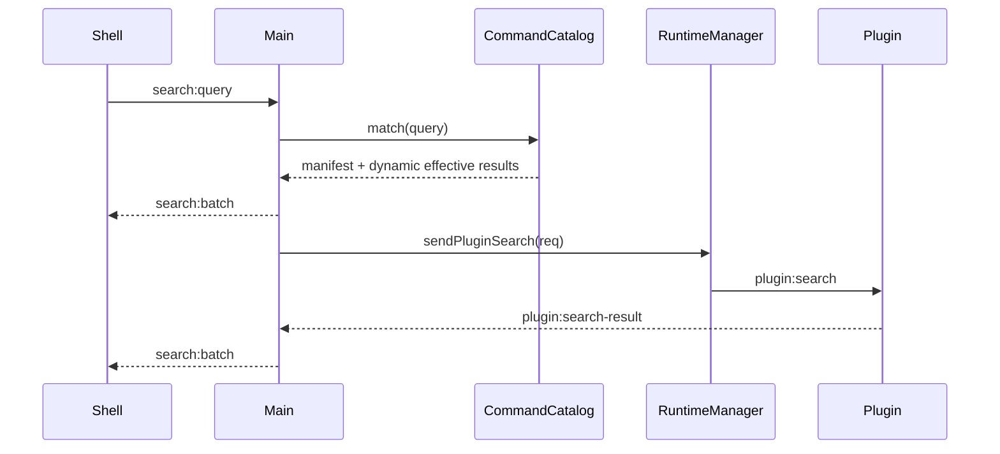

# 指令目录长期架构设计

## 概要

Szybko 的插件指令系统需要同时支持静态指令和动态指令。静态指令来自插件包内只读的 `plugin.json`，动态指令来自插件运行时调用 `setFeature`、`removeFeature` 等 API 产生的用户数据。两者应该在搜索和执行时呈现为一个统一的指令目录，但不能在持久化来源上混在一起。

本设计将插件发现、动态指令持久化、有效指令投影和搜索索引拆成明确边界。长期持久化采用一个 SQLite 平台数据库承载多张领域表，而不是在 `userData` 下不断新增独立 JSON 文件。

本阶段不设计或实现 `tools` / AI Agent 可调用工具能力。`tools` 后续应成为独立的 ToolCatalog，不与用户搜索指令混在一起。

## 目标

- 静态 features 和动态 features 在搜索时统一查询。
- 静态 features 的 source of truth 始终是插件包内的 `plugin.json`。
- 动态 features 的 source of truth 是平台数据库中的 override 记录。
- 插件运行时不能修改 `plugin.json`，只能通过主进程受控 API 修改自己的动态指令。
- 支持动态指令直接替换同插件同 `code` 的静态指令。
- 支持 `removeFeature(code)` 持久化删除语义，插件升级后同 `code` 的静态指令也不会自动恢复。
- 指令索引应可重建，不能成为唯一事实来源。

## 非目标

- 不实现 AI Agent `tools`。
- 不实现插件市场、签名、权限审核。
- 不实现用户别名、使用历史、排序偏好，但数据边界要为这些能力留空间。别名后续应按 cmd/trigger 级别建模，而不是 feature 级别。
- 不在本设计中要求完整支持 `regex`、`over`、`img`、`files`、`window` 的匹配执行细节；第一阶段可以继续只支持文本指令，结构上保留扩展点。

## 架构



## 边界

### PluginCatalog

负责插件身份和包声明：

- 扫描插件目录。
- 读取 `plugin.json`。
- 管理插件是否启用、安装路径、来源、版本、manifest hash。
- 不负责动态指令。
- 不负责搜索匹配。

### ManifestIndexer

负责把 `plugin.json` 中的 features 规范化为数据库快照：

- 校验 feature 结构。
- 计算 manifest hash。
- 在插件安装、启动扫描或升级时更新静态 feature snapshot。
- snapshot 是可重建缓存，不是唯一事实来源。

### FeatureOverrideStore

负责持久化动态指令事实：

- `setFeature(feature)` 写入 `active` override。
- `removeFeature(code)` 写入 `removed` tombstone。
- override 按 `pluginId + code` 隔离。
- 插件只能修改自己的 override。

### CommandProjectionBuilder

负责合成有效指令：

- 从 manifest snapshot 开始构建。
- 应用动态 override。
- 产出 `effective_feature` 和 `command_trigger`。
- 投影结果可随时从静态快照和动态 override 重建。

### CommandCatalog

负责提供运行时查询接口：

- `match(query)` 给搜索系统使用。
- `getEffectiveFeatures(pluginId, codes?)` 给管理 UI 或调试能力使用。
- 不直接写持久化事实。

## 持久化模型

长期方案采用一个 SQLite 平台数据库：

```text
userData/
  szybko-platform.db
```

数据库内部按领域拆表，而不是按领域拆文件。

### 数据库选型

- 存储引擎：SQLite。
- TypeScript 数据访问层：Drizzle ORM。
- SQLite driver：通过 Drizzle 的 SQLite driver 接入，并封装在 `PlatformDatabase` adapter 后面。初始实现优先使用 `node:sqlite`；如果 Electron 打包或运行时兼容性不满足，再在 adapter 内切换到 `better-sqlite3`。
- 数据库路径：`app.getPath('userData')/szybko-platform.db`。
- 访问位置：只在主进程或主进程拥有的 persistence/service 层访问，不向 renderer 或插件暴露数据库连接。
- 访问边界：业务模块通过 repository 接口读写数据，不直接散落 SQL。
- 事务要求：所有 projection 重建、插件升级索引、动态 feature 修改都必须在事务内完成。
- 运行配置：启用 `PRAGMA foreign_keys = ON`；启用 WAL journal mode；设置合理 `busy_timeout`。
- 迁移：使用 Drizzle schema 和 Drizzle migrations 管理。migration 文件必须进入版本控制。

Drizzle 是 schema、migration 和类型安全查询层。业务层仍然依赖 repository，不直接依赖具体 driver。driver 的选择不得影响 `PluginCatalog`、`FeatureOverrideStore`、`CommandCatalog` 等领域接口。

### Repository 边界

```text
PlatformDatabase
  - open()
  - transaction(fn)
  - migrate()
  - drizzle()

PluginInstallationRepository
  - listEnabled()
  - upsertInstallation()
  - setEnabled()

ManifestFeatureRepository
  - replaceSnapshotForPlugin()
  - listSnapshotByPlugin()

FeatureOverrideRepository
  - setActive()
  - setRemoved()
  - clearOverride()
  - listByPlugin()
  - listActiveByPlugin()

CommandProjectionRepository
  - replaceProjectionForPlugin()
  - matchTextCommand()
  - listEffectiveFeatures()
```

`PlatformDatabase.drizzle()` 返回的 Drizzle database handle 只允许 repository 层使用。业务服务、IPC handler、runtime manager 和 renderer preload 都不能直接依赖 Drizzle API。

### Schema 原则

- 事实表和投影表必须分开。`plugin_installation`、`manifest_feature_snapshot`、`feature_override` 是事实来源或事实快照；`effective_feature`、`command_trigger`、`command_projection_meta` 是可重建投影。
- JSON 字段只保存完整 feature 或 matcher blob。需要查询、约束或索引的字段必须提升为普通列。
- 所有时间字段使用 Unix milliseconds integer，避免混用 ISO string 和 number。
- Boolean 使用 `INTEGER`，并用 `CHECK (value IN (0, 1))` 约束。
- 所有业务写入必须通过 repository，不能在 IPC handler 或 UI service 中直接拼 SQL。
- 下面 DDL 是逻辑 schema。实现时用 Drizzle schema 表达等价结构，并用 Drizzle migrations 生成或维护等价 migration。Drizzle 无法表达或不适合表达的 SQLite 细节，例如 partial index、特定 `CHECK`、PRAGMA，应通过 custom SQL migration 补齐。

### Migration metadata

使用 Drizzle 自带 migration metadata 表记录已应用 migration。不额外维护自定义 `schema_migration` 表，避免两套 migration 状态互相漂移。

### plugin_installation

插件安装状态表。它取代当前 registry JSON 的长期存储职责。

```sql
CREATE TABLE plugin_installation (
  plugin_id TEXT PRIMARY KEY CHECK (length(trim(plugin_id)) > 0),
  source TEXT NOT NULL CHECK (source IN ('built-in', 'local-dev', 'user-installed')),
  enabled INTEGER NOT NULL DEFAULT 1 CHECK (enabled IN (0, 1)),
  install_path TEXT NOT NULL CHECK (length(trim(install_path)) > 0),
  version TEXT,
  manifest_hash TEXT NOT NULL DEFAULT '',
  manifest_indexed_at INTEGER,
  created_at INTEGER NOT NULL,
  updated_at INTEGER NOT NULL
);

CREATE INDEX idx_plugin_installation_enabled
  ON plugin_installation(enabled, source);
```

`manifest_hash` 用于判断插件包内 `plugin.json` 是否变化。`source` 后续如果需要支持市场来源，应通过 migration 扩展枚举，而不是提前把市场表混进当前设计。

### manifest_feature_snapshot

从 `plugin.json` 重建的静态 feature 快照。插件包仍然是静态 features 的唯一事实来源；该表用于索引和差异判断，不允许插件运行时写入。

```sql
CREATE TABLE manifest_feature_snapshot (
  plugin_id TEXT NOT NULL,
  code TEXT NOT NULL CHECK (length(trim(code)) > 0),
  feature_order INTEGER NOT NULL CHECK (feature_order >= 0),
  feature_json TEXT NOT NULL CHECK (json_valid(feature_json)),
  feature_hash TEXT NOT NULL,
  manifest_hash TEXT NOT NULL,
  indexed_at INTEGER NOT NULL,
  PRIMARY KEY (plugin_id, code),
  UNIQUE (plugin_id, feature_order),
  FOREIGN KEY (plugin_id)
    REFERENCES plugin_installation(plugin_id)
    ON DELETE CASCADE
);
```

`feature_json` 应保存规范化后的 feature JSON，例如稳定 key 顺序、已补默认值、已过滤未知字段。`feature_hash` 用于比较单个 feature 是否变化。

### feature_override

动态 feature 的唯一事实来源。`active` 表示动态 feature 直接替换同 `plugin_id + code` 的静态 feature；`removed` 表示 tombstone，禁止同 code 的 manifest feature 自动恢复。

```sql
CREATE TABLE feature_override (
  plugin_id TEXT NOT NULL,
  code TEXT NOT NULL CHECK (length(trim(code)) > 0),
  state TEXT NOT NULL CHECK (state IN ('active', 'removed')),
  feature_json TEXT,
  feature_hash TEXT,
  created_at INTEGER NOT NULL,
  updated_at INTEGER NOT NULL,
  PRIMARY KEY (plugin_id, code),
  CHECK (
    (state = 'active' AND feature_json IS NOT NULL AND json_valid(feature_json) AND feature_hash IS NOT NULL)
    OR
    (state = 'removed' AND feature_json IS NULL AND feature_hash IS NULL)
  ),
  FOREIGN KEY (plugin_id)
    REFERENCES plugin_installation(plugin_id)
    ON DELETE CASCADE
);

CREATE INDEX idx_feature_override_plugin_state
  ON feature_override(plugin_id, state);
```

`removeFeature(code)` 不删除该行，而是 upsert 为 `state = 'removed'`。如果未来需要“清除 override 并恢复 manifest 默认值”，应提供平台管理 API 删除该 override 行；插件运行时的 `removeFeature` 不承担恢复默认值语义。

### effective_feature

当前有效 feature 投影。搜索、插件管理 UI、调试视图都应读取该表或读取由该表派生的内存索引。它不是事实来源，可以从 snapshot + override 重建。

```sql
CREATE TABLE effective_feature (
  plugin_id TEXT NOT NULL,
  code TEXT NOT NULL CHECK (length(trim(code)) > 0),
  source TEXT NOT NULL CHECK (source IN ('manifest', 'dynamic')),
  feature_order INTEGER NOT NULL CHECK (feature_order >= 0),
  feature_json TEXT NOT NULL CHECK (json_valid(feature_json)),
  feature_hash TEXT NOT NULL,
  rebuilt_at INTEGER NOT NULL,
  PRIMARY KEY (plugin_id, code),
  UNIQUE (plugin_id, feature_order),
  FOREIGN KEY (plugin_id)
    REFERENCES plugin_installation(plugin_id)
    ON DELETE CASCADE
);

CREATE INDEX idx_effective_feature_plugin_source
  ON effective_feature(plugin_id, source);
```

动态新增的 feature 如果没有 manifest 顺序，`feature_order` 应排在 manifest features 之后，并保持 deterministic，例如按动态 code 排序后分配顺序。

### command_trigger

由 effective features 的 `cmds` 展开的触发器投影。它是搜索系统的主要查询表，不保存无法从 effective feature 重建的事实。

```sql
CREATE TABLE command_trigger (
  plugin_id TEXT NOT NULL,
  feature_code TEXT NOT NULL CHECK (length(trim(feature_code)) > 0),
  cmd_key TEXT NOT NULL CHECK (length(trim(cmd_key)) > 0),
  trigger_index INTEGER NOT NULL CHECK (trigger_index >= 0),
  source TEXT NOT NULL CHECK (source IN ('feature_cmd', 'alias')),
  type TEXT NOT NULL CHECK (type IN ('text', 'regex', 'over', 'img', 'files', 'window')),
  label TEXT,
  matcher_json TEXT NOT NULL CHECK (json_valid(matcher_json)),
  normalized_key TEXT,
  alias_id INTEGER,
  target_cmd_key TEXT,
  score_base INTEGER NOT NULL DEFAULT 90,
  rebuilt_at INTEGER NOT NULL,
  PRIMARY KEY (plugin_id, feature_code, source, cmd_key),
  CHECK (
    (type = 'text' AND normalized_key IS NOT NULL AND length(normalized_key) > 0)
    OR
    (type <> 'text')
  ),
  CHECK (
    (source = 'feature_cmd' AND alias_id IS NULL AND target_cmd_key IS NULL)
    OR
    (source = 'alias' AND alias_id IS NOT NULL AND target_cmd_key IS NOT NULL)
  ),
  FOREIGN KEY (plugin_id, feature_code)
    REFERENCES effective_feature(plugin_id, code)
    ON DELETE CASCADE
);

CREATE INDEX idx_command_trigger_text_lookup
  ON command_trigger(normalized_key, plugin_id, feature_code, source)
  WHERE type = 'text';

CREATE INDEX idx_command_trigger_type
  ON command_trigger(type);

CREATE INDEX idx_command_trigger_target_cmd
  ON command_trigger(plugin_id, feature_code, target_cmd_key)
  WHERE source = 'alias';
```

`matcher_json` 对 string command 保存为 `{"type":"text","text":"原始指令"}`。对象 command 保存为规范化后的 matcher object。第一阶段可只查询 `type = 'text'` 的触发器；其他类型可以入表但不参与搜索，也可以在 projection builder 中跳过并记录不支持，二者必须在实现计划里明确选择。

`normalized_key` 由平台统一生成，不由插件提供。文本指令的归一化规则应至少包含 trim、Unicode NFKC 和大小写折叠；如果归一化后为空，projection builder 必须拒绝该 trigger。

`cmd_key` 是单条 cmd 的稳定身份，不等同于 `trigger_index`。`trigger_index` 只保存当前 feature 内的展示顺序；`cmd_key` 用于后续别名、禁用、排序偏好、使用历史等用户偏好关联。生成规则应基于规范化 matcher，例如：

```text
text:设置        -> hash("text:<normalized_key>")
regex:^tr\s+.+  -> hash("regex:<normalized_regex>")
files:...       -> hash("files:<normalized matcher json>")
```

同一 `plugin_id + feature_code` 下，如果两个 cmds 生成相同 `cmd_key`，projection builder 必须去重或拒绝该 feature，不能写入两个身份相同的 trigger。

### command_alias（未来扩展）

别名不在当前阶段实现，但 schema 设计必须为它保留正确归属。别名属于 cmd/trigger 级别，表示“用户给某条 cmd 增加一个额外触发方式”，不是新增 feature，也不是改写 feature 的 `cmds`。

未来别名事实表应类似：

```sql
CREATE TABLE command_alias (
  alias_id INTEGER PRIMARY KEY AUTOINCREMENT,
  plugin_id TEXT NOT NULL,
  feature_code TEXT NOT NULL CHECK (length(trim(feature_code)) > 0),
  target_cmd_key TEXT NOT NULL CHECK (length(trim(target_cmd_key)) > 0),
  alias TEXT NOT NULL CHECK (length(trim(alias)) > 0),
  normalized_key TEXT NOT NULL CHECK (length(normalized_key) > 0),
  enabled INTEGER NOT NULL DEFAULT 1 CHECK (enabled IN (0, 1)),
  created_at INTEGER NOT NULL,
  updated_at INTEGER NOT NULL,
  UNIQUE (plugin_id, feature_code, normalized_key),
  FOREIGN KEY (plugin_id, feature_code)
    REFERENCES effective_feature(plugin_id, code)
    ON DELETE CASCADE
);

CREATE INDEX idx_command_alias_lookup
  ON command_alias(normalized_key)
  WHERE enabled = 1;

CREATE INDEX idx_command_alias_target_cmd
  ON command_alias(plugin_id, feature_code, target_cmd_key);
```

别名投影规则：

- `command_alias` 是别名事实来源。
- `command_trigger(source = 'alias')` 是别名搜索投影。
- alias trigger 的 `cmd_key` 使用 alias 自身身份，例如 `alias:<alias_id>`。
- alias trigger 的 `target_cmd_key` 指向原始 cmd。
- alias trigger 的 `trigger_index` 继承目标 cmd 的 `trigger_index`，让搜索排序仍按原始 cmd 所属顺序稳定排列。
- 实现别名时，`command_trigger.alias_id` 可以外键引用 `command_alias(alias_id)`；`target_cmd_key` 不应外键引用 `command_trigger`，否则原始 cmd 消失时会破坏 alias 事实保留语义。
- 如果插件升级后原始 `target_cmd_key` 不再存在，alias 记录保留，但不投影进 `command_trigger`，因此不参与搜索。
- 如果原始 `target_cmd_key` 未来重新出现，alias 可以重新投影并恢复生效。
- alias 命中后仍进入同一个 `feature_code`，插件不需要知道用户命中的是原始 cmd 还是 alias；平台可在 action metadata 中保留 `source` 和 `target_cmd_key` 供后续统计使用。

### command_projection_meta

投影元数据表，用来判断 projection 是否与当前 manifest snapshot、dynamic overrides 和索引版本一致。

```sql
CREATE TABLE command_projection_meta (
  plugin_id TEXT PRIMARY KEY,
  manifest_hash TEXT NOT NULL,
  override_fingerprint TEXT NOT NULL,
  index_version INTEGER NOT NULL,
  rebuilt_at INTEGER NOT NULL,
  FOREIGN KEY (plugin_id)
    REFERENCES plugin_installation(plugin_id)
    ON DELETE CASCADE
);
```

`index_version` 由平台代码定义。当 command normalization、matcher 展开规则或排序基础分变化时递增，并触发全量 projection 重建。

## 合并规则

有效 feature 的 identity 是：

```text
pluginId + code
```

合并流程：

1. 读取该插件的 `manifest_feature_snapshot`，初始化 effective map。
2. 读取该插件的 `feature_override`。
3. 对每条 override：
   - `state = active`：用动态 feature 直接替换同 `pluginId + code` 的静态 feature。
   - `state = removed`：从 effective map 删除同 `pluginId + code`。
4. 将 effective map 写入 `effective_feature`。
5. 将 effective features 的 `cmds` 展开为 `command_trigger(source = 'feature_cmd')`，并为每条 cmd 生成稳定 `cmd_key`。
6. 未来支持别名时，再将启用且目标 `cmd_key` 仍存在的 `command_alias` 展开为 `command_trigger(source = 'alias')`。

示例：

```text
manifest: prefs -> ["设置"]
override: none
effective: prefs -> ["设置"], source = manifest

manifest: prefs -> ["设置"]
override: prefs active ["首选项", "config"]
effective: prefs -> ["首选项", "config"], source = dynamic

manifest: prefs -> ["设置"]
override: prefs removed
effective: prefs 不存在
```

插件升级时，如果 manifest 又包含被 `removed` 的同 code，仍然不恢复。只有插件重新 `setFeature` 或平台提供用户操作清除 override，才会改变动态层语义。

## 插件运行时 API

插件侧 API：

```ts
setFeature(feature: PluginFeature): Promise<{ ok: boolean; error?: string }>;
getFeatures(codes?: string[]): Promise<PluginFeature[]>;
removeFeature(code: string): Promise<{ ok: boolean }>;
```

主进程必须根据发起 IPC 的 `webContents` 查找 runtime，再得到 `pluginId`。插件调用 API 时不能传入或覆盖 `pluginId`。

API 行为：

- `setFeature(feature)`：校验 feature，写入 `feature_override(active)`，重建该插件投影。
- `getFeatures(codes?)`：返回当前插件动态层的 active features，不包含 manifest 静态 features。
- `removeFeature(code)`：写入 `feature_override(removed)`，重建该插件投影。

平台内部另提供：

```ts
getEffectiveFeatures(pluginId: string, codes?: string[]): FeatureRecord[];
```

该接口给搜索、插件管理 UI 或调试视图使用。

## 搜索流程



`registerIpcHandlers` 不再调用 `PluginCatalog.matchFeatures()`。搜索入口只依赖 `CommandCatalog.match()`。

第一阶段的 `match()` 行为可以保持当前语义：

- 只支持 string command。
- 归一化后精确匹配。
- 命中后生成 `plugin.open` action，payload 包含 `pluginId` 和 `featureCode`。

文本指令查询必须过滤禁用插件：

```sql
SELECT
  ct.plugin_id,
  ct.feature_code,
  ct.cmd_key,
  ct.trigger_index,
  ct.source,
  ct.target_cmd_key,
  ct.label,
  ct.score_base,
  ef.feature_json
FROM command_trigger ct
JOIN effective_feature ef
  ON ef.plugin_id = ct.plugin_id
 AND ef.code = ct.feature_code
JOIN plugin_installation pi
  ON pi.plugin_id = ct.plugin_id
WHERE pi.enabled = 1
  AND ct.type = 'text'
  AND ct.normalized_key = ?
ORDER BY
  ct.score_base DESC,
  ef.feature_order ASC,
  CASE ct.source WHEN 'feature_cmd' THEN 0 ELSE 1 END ASC,
  ct.trigger_index ASC;
```

后续可以在 `CommandIndex` 内扩展 regex、over、files、img、window 等 matcher。

## 数据重建

以下事件需要重建单个插件的 projection：

- 插件安装。
- 插件启用。
- 插件升级，manifest hash 变化。
- 插件调用 `setFeature`。
- 插件调用 `removeFeature`。
- 平台清除某插件 override。

以下事件需要重建全量 projection：

- 数据库迁移。
- 索引版本变化。
- 平台升级导致 command normalization 规则变化。

重建必须是事务性的：

1. `BEGIN IMMEDIATE`，串行化同一数据库内的写事务。
2. 读取该插件的 `manifest_feature_snapshot` 和 `feature_override`。
3. 在内存中按合并规则生成 effective features 和 command triggers。
4. 删除该插件旧的 `effective_feature`。`command_trigger` 通过外键 `ON DELETE CASCADE` 自动删除。
5. 插入新的 `effective_feature`。
6. 插入新的 `command_trigger`。
7. upsert `command_projection_meta`，写入 `manifest_hash`、`override_fingerprint`、`index_version`、`rebuilt_at`。
8. `COMMIT`。
9. 提交事务后通知搜索层索引变化。

如果任一步失败，整个事务必须回滚。不得出现 `effective_feature` 已更新但 `command_trigger` 仍是旧索引的状态。

插件 manifest 变化时，静态快照替换和 projection 重建也应在同一事务内完成：

1. 更新 `plugin_installation.manifest_hash` 和 `manifest_indexed_at`。
2. 删除该插件旧的 `manifest_feature_snapshot`。
3. 插入新的 manifest feature snapshot。
4. 按上面的 projection 重建流程刷新 effective 和 trigger。

动态 feature 修改时，override 写入和 projection 重建应在同一事务内完成：

1. `setFeature` upsert `feature_override(state = 'active')`。
2. 或 `removeFeature` upsert `feature_override(state = 'removed')`。
3. 重建该插件 projection。

## 校验与安全

`setFeature` 必须校验：

- `code` 非空且长度有限。
- `cmds` 是非空数组。
- `cmds` 中对象类型必须属于允许集合。
- 正则类 matcher 必须能编译，且可设置长度限制。
- icon 支持相对路径或 data URL，但需要限制体积。
- platform 如果存在，只能是支持的平台值。

插件不能：

- 修改其他插件的 feature override。
- 修改 `plugin.json`。
- 直接访问平台数据库。
- 通过动态 feature 引入未声明的高权限能力。

## 与当前代码的关系

当前 `PluginCatalog.matchFeatures()` 应迁移到 `CommandCatalog.match()`。

当前 `PluginManifest.features` 类型可以继续作为静态 feature 和动态 feature 的基础类型，但需要扩展动态 feature 的 `platform` 和 base64 icon 兼容能力。

当前 lowdb `Store` 只是现有实现状态，不应作为长期指令系统的数据边界。长期数据库应迁移到单一 SQLite 平台数据库，并通过 Drizzle-backed repository 访问。迁移时可以先保留 `PluginRegistry`、`FeatureOverrideStore`、`CommandCatalog` 等领域接口，再把底层从 JSON store 替换为 Drizzle repository。

## 测试重点

- schema migration 可在空数据库上创建所有表、索引和外键。
- `plugin_id + code` 在 manifest snapshot、feature override、effective feature 中保持唯一。
- 同一 `plugin_id + feature_code` 下每条 cmd 都生成稳定 `cmd_key`，且 `cmd_key` 不依赖 `trigger_index`。
- `feature_override` 不允许 `active` 缺少 `feature_json`，也不允许 `removed` 携带 `feature_json`。
- 删除插件安装记录会级联清理 snapshot、override、effective、trigger 和 projection meta。
- 禁用插件后，已有 `command_trigger` 不会被搜索命中。
- manifest feature 无 override 时可以被搜索命中。
- dynamic active 同 code 直接替换 manifest feature。
- dynamic removed 同 code 后搜索不再命中，插件重启后仍不恢复。
- 插件升级后，被 override 或 removed 的 code 仍按动态层语义生效。
- 插件 A 不能修改插件 B 的 dynamic features。
- 未来别名必须关联 `plugin_id + feature_code + target_cmd_key`，不能直接挂到 feature 级别。
- 未来别名目标 cmd 消失时，alias 事实记录保留，但不投影到 `command_trigger`。
- projection 重建后 `effective_feature` 和 `command_trigger` 没有旧数据残留。
- projection 重建失败时事务回滚，不会留下半新半旧的 effective/trigger 数据。
- 搜索入口不再依赖 `PluginCatalog.matchFeatures()`。
