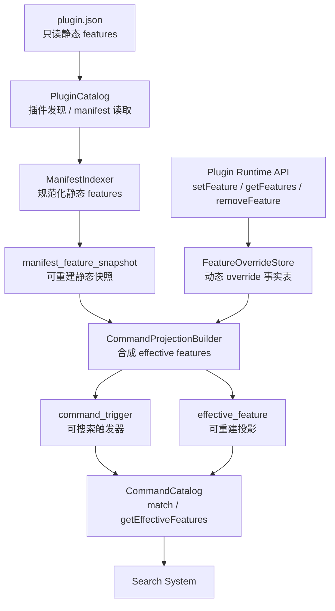
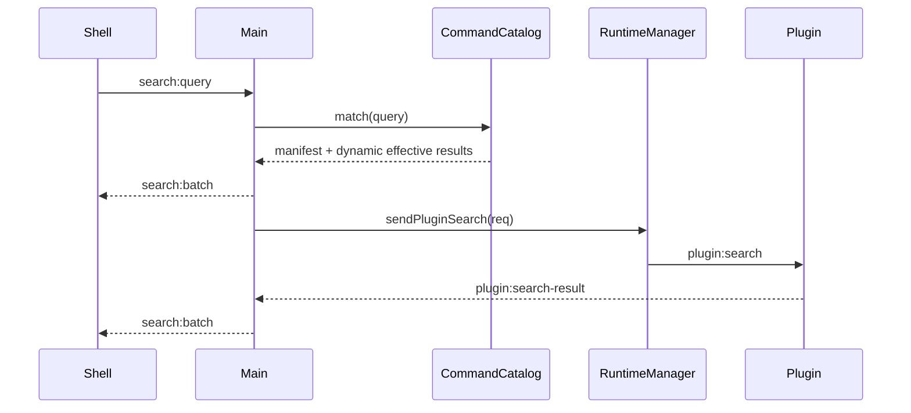

# 指令目录长期架构设计

## 概要

Szybko 的插件指令系统需要同时支持静态指令和动态指令。静态指令来自插件包内只读的 `plugin.json`，动态指令来自插件运行时调用 `setFeature`、`removeFeature` 等 API 产生的用户数据。两者应该在搜索和执行时呈现为一个统一的指令目录，但不能在持久化来源上混在一起。

本设计将插件发现、动态指令持久化、有效指令投影和搜索索引拆成明确边界。长期持久化采用一个平台数据库承载多张领域表，而不是在 `userData` 下不断新增独立 JSON 文件。

本阶段不设计或实现 `tools` / AI Agent 可调用工具能力。`tools` 后续应成为独立的 ToolCatalog，不与用户搜索指令混在一起。

## 目标

- 静态 features 和动态 features 在搜索时统一查询。
- 静态 features 的 source of truth 始终是插件包内的 `plugin.json`。
- 动态 features 的 source of truth 是平台数据库中的 override 记录。
- 插件运行时不能修改 `plugin.json`，只能通过主进程受控 API 修改自己的动态指令。
- 支持动态指令直接替换同插件同 `code` 的静态指令。
- 支持 `removeFeature(code)` 持久化删除语义，插件升级后同 `code` 的静态指令也不会自动恢复。
- 指令索引应可重建，不能成为唯一事实来源。

## 非目标

- 不实现 AI Agent `tools`。
- 不实现插件市场、签名、权限审核。
- 不实现用户别名、使用历史、排序偏好，但数据边界要为这些能力留空间。
- 不在本设计中要求完整支持 `regex`、`over`、`img`、`files`、`window` 的匹配执行细节；第一阶段可以继续只支持文本指令，结构上保留扩展点。

## 架构



## 边界

### PluginCatalog

负责插件身份和包声明：

- 扫描插件目录。
- 读取 `plugin.json`。
- 管理插件是否启用、安装路径、来源、版本、manifest hash。
- 不负责动态指令。
- 不负责搜索匹配。

### ManifestIndexer

负责把 `plugin.json` 中的 features 规范化为数据库快照：

- 校验 feature 结构。
- 计算 manifest hash。
- 在插件安装、启动扫描或升级时更新静态 feature snapshot。
- snapshot 是可重建缓存，不是唯一事实来源。

### FeatureOverrideStore

负责持久化动态指令事实：

- `setFeature(feature)` 写入 `active` override。
- `removeFeature(code)` 写入 `removed` tombstone。
- override 按 `pluginId + code` 隔离。
- 插件只能修改自己的 override。

### CommandProjectionBuilder

负责合成有效指令：

- 从 manifest snapshot 开始构建。
- 应用动态 override。
- 产出 `effective_feature` 和 `command_trigger`。
- 投影结果可随时从静态快照和动态 override 重建。

### CommandCatalog

负责提供运行时查询接口：

- `match(query)` 给搜索系统使用。
- `getEffectiveFeatures(pluginId, codes?)` 给管理 UI 或调试能力使用。
- 不直接写持久化事实。

## 持久化模型

长期方案采用一个平台数据库，例如：

```text
userData/
  szybko-platform.db
```

数据库内部按领域拆表，而不是按领域拆文件。

### plugin_installation

```text
pluginId
source
enabled
path
version
manifestHash
installedAt
updatedAt
```

### manifest_feature_snapshot

```text
pluginId
code
featureJson
manifestHash
indexedAt
```

该表是从 `plugin.json` 重建的静态快照。插件包仍然是静态 features 的唯一事实来源。

### feature_override

```text
pluginId
code
state: active | removed
featureJson
updatedAt
```

该表是动态 features 的事实来源。

`active` 记录保存完整动态 feature。`removed` 记录保存删除 tombstone，`featureJson` 可以为空。

### effective_feature

```text
pluginId
code
source: manifest | dynamic
featureJson
updatedAt
```

该表是可重建投影，表示搜索和运行时看到的当前有效 feature。

### command_trigger

```text
pluginId
featureCode
triggerIndex
type: text | regex | over | img | files | window
label
matcherJson
normalizedKey
scoreBase
```

该表是可重建搜索索引。第一阶段可只对 `type = text` 建可用匹配，其他类型先规范化入表但不参与搜索，或明确跳过并记录不支持。

## 合并规则

有效 feature 的 identity 是：

```text
pluginId + code
```

合并流程：

1. 读取该插件的 `manifest_feature_snapshot`，初始化 effective map。
2. 读取该插件的 `feature_override`。
3. 对每条 override：
   - `state = active`：用动态 feature 直接替换同 `pluginId + code` 的静态 feature。
   - `state = removed`：从 effective map 删除同 `pluginId + code`。
4. 将 effective map 写入 `effective_feature`。
5. 将 effective features 的 `cmds` 展开写入 `command_trigger`。

示例：

```text
manifest: prefs -> ["设置"]
override: none
effective: prefs -> ["设置"], source = manifest

manifest: prefs -> ["设置"]
override: prefs active ["首选项", "config"]
effective: prefs -> ["首选项", "config"], source = dynamic

manifest: prefs -> ["设置"]
override: prefs removed
effective: prefs 不存在
```

插件升级时，如果 manifest 又包含被 `removed` 的同 code，仍然不恢复。只有插件重新 `setFeature` 或平台提供用户操作清除 override，才会改变动态层语义。

## 插件运行时 API

插件侧 API：

```ts
setFeature(feature: PluginFeature): Promise<{ ok: boolean; error?: string }>;
getFeatures(codes?: string[]): Promise<PluginFeature[]>;
removeFeature(code: string): Promise<{ ok: boolean }>;
```

主进程必须根据发起 IPC 的 `webContents` 查找 runtime，再得到 `pluginId`。插件调用 API 时不能传入或覆盖 `pluginId`。

API 行为：

- `setFeature(feature)`：校验 feature，写入 `feature_override(active)`，重建该插件投影。
- `getFeatures(codes?)`：返回当前插件动态层的 active features，不包含 manifest 静态 features。
- `removeFeature(code)`：写入 `feature_override(removed)`，重建该插件投影。

平台内部另提供：

```ts
getEffectiveFeatures(pluginId: string, codes?: string[]): FeatureRecord[];
```

该接口给搜索、插件管理 UI 或调试视图使用。

## 搜索流程



`registerIpcHandlers` 不再调用 `PluginCatalog.matchFeatures()`。搜索入口只依赖 `CommandCatalog.match()`。

第一阶段的 `match()` 行为可以保持当前语义：

- 只支持 string command。
- 归一化后精确匹配。
- 命中后生成 `plugin.open` action，payload 包含 `pluginId` 和 `featureCode`。

后续可以在 `CommandIndex` 内扩展 regex、over、files、img、window 等 matcher。

## 数据重建

以下事件需要重建单个插件的 projection：

- 插件安装。
- 插件启用。
- 插件升级，manifest hash 变化。
- 插件调用 `setFeature`。
- 插件调用 `removeFeature`。
- 平台清除某插件 override。

以下事件需要重建全量 projection：

- 数据库迁移。
- 索引版本变化。
- 平台升级导致 command normalization 规则变化。

重建必须是事务性的：

1. 删除该插件旧的 `effective_feature` 和 `command_trigger`。
2. 根据 snapshot + override 重新写入 effective features。
3. 展开 cmds 重新写入 command triggers。
4. 提交事务后通知搜索层索引变化。

## 校验与安全

`setFeature` 必须校验：

- `code` 非空且长度有限。
- `cmds` 是非空数组。
- `cmds` 中对象类型必须属于允许集合。
- 正则类 matcher 必须能编译，且可设置长度限制。
- icon 支持相对路径或 data URL，但需要限制体积。
- platform 如果存在，只能是支持的平台值。

插件不能：

- 修改其他插件的 feature override。
- 修改 `plugin.json`。
- 直接访问平台数据库。
- 通过动态 feature 引入未声明的高权限能力。

## 与当前代码的关系

当前 `PluginCatalog.matchFeatures()` 应迁移到 `CommandCatalog.match()`。

当前 `PluginManifest.features` 类型可以继续作为静态 feature 和动态 feature 的基础类型，但需要扩展动态 feature 的 `platform` 和 base64 icon 兼容能力。

当前 lowdb `Store` 只是现有实现状态，不应作为长期指令系统的数据边界。长期数据库应迁移到单一平台 DB。迁移时可以先保留 `PluginRegistry`、`FeatureOverrideStore`、`CommandCatalog` 等领域接口，再把底层从 JSON store 替换为 DB repository。

## 测试重点

- manifest feature 无 override 时可以被搜索命中。
- dynamic active 同 code 直接替换 manifest feature。
- dynamic removed 同 code 后搜索不再命中，插件重启后仍不恢复。
- 插件升级后，被 override 或 removed 的 code 仍按动态层语义生效。
- 插件 A 不能修改插件 B 的 dynamic features。
- projection 重建后 `effective_feature` 和 `command_trigger` 没有旧数据残留。
- 搜索入口不再依赖 `PluginCatalog.matchFeatures()`。
